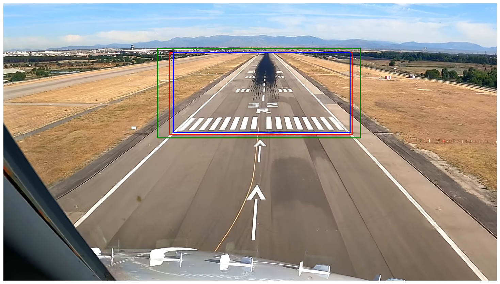

# ✈️ Robust Vision-Based Runway Detection through Conformal Prediction and Conformal mAP 

###  **Alya ZOUZOU**, **Mélanie DUCOFFE**, XXXX
📄 *Read the full paper here* [*link to be inserted*] 

## Use Case Presentation
This work explores the application of conformal prediction using the Puncc library to quantify the uncertainty of bounding boxes for runway detection in video footage captured during the landing phase of aircraft.

We leverage pretrained YOLOv5 and YOLOv6 object detection models to provide statistical guarantees on the coverage of predicted bounding boxes. This approach supports the development of more robust and reliable vision-based landing systems, especially in critical aviation scenarios.



### Contributions

- **Conformal Prediction for Runway Detection**: We apply conformal prediction with different margin methods (additive/multiplicative penalties) on YOLOv5 and YOLOv6 for runway detection in aerial images.
- **Conformal Mean Average Precision (C-mAP)**: A new metric to evaluate bounding box predictions based on their accuracy and coverage of ground truth boxes, aligning conformal prediction with object detection benchmarks.
- **Open-source Resources**: We release our code, trained models, and experimental protocols to promote reproducibility and further research.


Rajouter légende 
###  LARD (Landing Approach Runway Detection – Dataset for Vision Based Landing)

| Set          | Type         |  Images |
|--------------|--------------|----------|
| Train        | Synthetic    | 11,546   |
| Validation   | Synthetic    | 2,886    |
| Test         | Real+Synth   | 2,315    |
| Test Synth   | Synthetic    | 2,212    |
| Test Real    | Real         | 103      |

> ⚠️ `base/` directory must be downloaded separately (containing Test, Test Synth & Test Real directories).


## Models Used

| Model    | Pretrained | Epochs | Batch | Img Size | FLOPs         |
|----------|------------|--------|-------|----------|----------------|
| YOLOv5s  | Yes        | 100    | 16    | 640      | 15.8 GFLOPs    |
| YOLOv6s  | Yes        | 97     | 32    | 640      | 45.3 GFLOPs    |


## Data Augmentation & Performance Summary

Same for both models:
```yaml
hsv_h: 0.015
hsv_s: 0.7
hsv_v: 0.4
degrees: 0.0
translate: 0.1
scale: 0.5
shear: 0.0
flipud: 0.0
fliplr: 0.5
mosaic: 1.0
mixup: 0.0
copy_paste: 0.0
```


| Metric            | YOLOv5 Pretrained | YOLOv6 Pretrained |
|------------------|------------------|------------------|
| **mAP@0.5**       | 0.995            | 0.990            |
| **mAP@0.5:0.95**  | 0.971            | 0.941            |


## Experiments Overview

- Methods: **Multiplicative**, **Additive**
- Confidence level: α = 0.3 → 70% coverage
- Metrics: **Average Coverage**, **Average Area**, **mAP@0.5**, **mAP@0.5:0.95**,

| Model      | Test Type | Method        | α | Coverage |
|------------|-----------|---------------|---|----------|
| YOLOv5     | Global    | Multiplicative| 0.3 | 0.759 |
| YOLOv6     | Global    | Multiplicative| 0.3 | 0.739 |
| YOLOv5     | Global    | Additive | 0.3 | 0.770 |
| YOLOv6     | Global    | Additive | 0.3 | 0.757 |
| YOLOv5     | Synth     | Multiplicative | 0.3 | 0.774 |
| YOLOv6     | Synth     | Multiplicative | 0.3 | 0.743 |
| YOLOv5     | Synth     | Additive | 0.3 | 0.767 |
| YOLOv6     | Synth     | Additive | 0.3 | 0.734 |

#### Conformal-mAP Results

| Model         | mAP   | C-mAP | C-mAP@50@80:100 |
|---------------|-------|-------|-----------------|
| YOLOv5        | 96.88 | 0.77  | 46.92           |
| c-YOLOv5-a    | 92.67 | 56.86 | 80.73           |
| c-YOLOv5-m    | 96.17 | 55.84 | 82.18           |
| YOLOv6        | 98.13 | 1.31  | 51.94           |
| c-YOLOv6-a    | 95.09 | 55.75 | 81.86           |
| c-YOLOv6-m    | 96.71 | 52.71 | 81.93           |


## 📂 Project Structure
```
📂 conformal_runway_detection/
├── 📁 before_cp/             # evaluating yolo's performances before conformal prediction
├── 📁 calibration/           # Calibration dataset splits & results
├── 📁 exp/                   # Experiments ipynb files
├── 📁 plots/                 # performances figures & footage example
├── 📁 surrogate/             # Slant distance analysis, correlations
├── 📁 utils/                 # IoU, IoA functions, yolo wrapper, pipeline etc.
├── 📁 base/                  # 📥 To download (images, labels)
├── 📄 requirements.txt
└── 📄 README.md
```

##  To encourage reproducibility

```bash
git clone https://github.com/alyasltd/conformal_runway_detection
cd conformal_runway_detection
pip install -r requirements.txt
```
